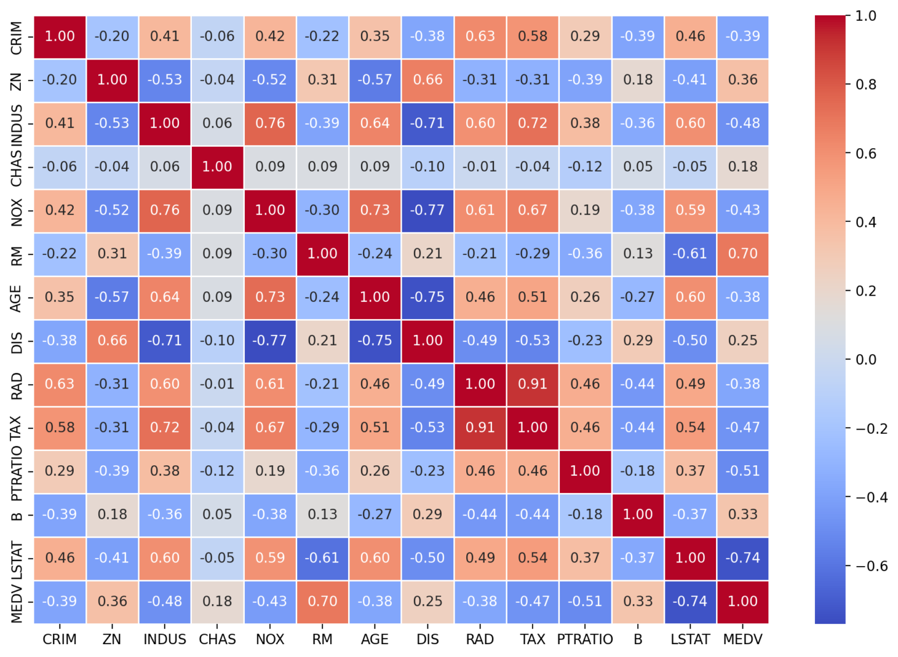
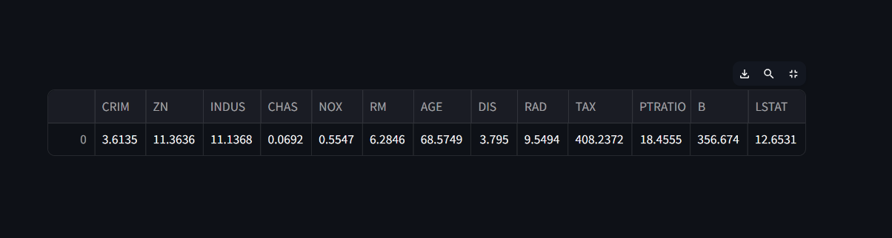
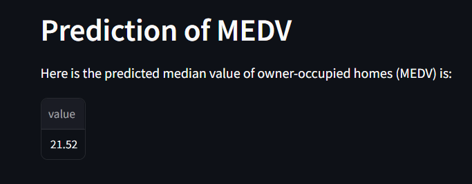
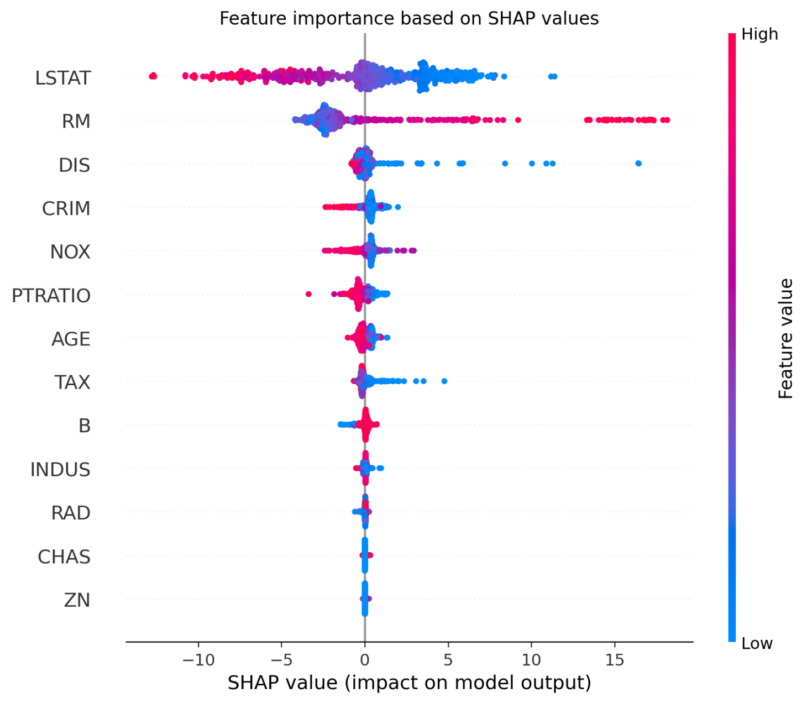
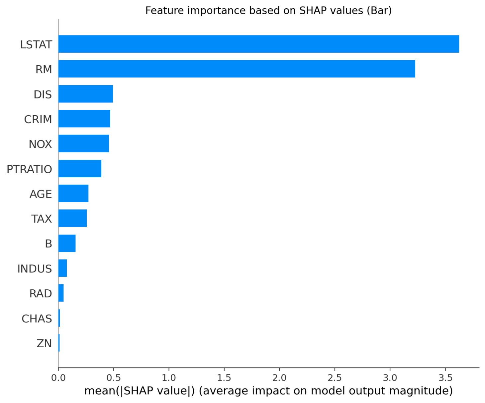

# House Price Prediction App

This repository contains code for a Streamlit web application that predicts the Boston house prices based on various features. The app provides an interface for users to adjust input parameters and obtain predictions along with explanations.

## Dataset Information

The dataset used in this application contains information collected by the U.S Census Service concerning housing in the area of Boston, MA. It includes various features such as per capita crime rate by town, average number of rooms per dwelling, proportion of non-retail business acres per town, and more.

You can find the dataset [here](http://lib.stat.cmu.edu/datasets/boston).

## How to Use

1. Clone the repository to your local machine.
2. Install the required dependencies using `pip install -r requirements.txt`.
3. Run the Streamlit app using `streamlit run app.py`.
4. Adjust the input parameters from the sidebar to predict the median value of owner-occupied homes (MEDV) in Boston.

## Features

- **CRIM**: Per capita crime rate by town.
- **ZN**: Proportion of residential land zoned for lots over 25,000 sq.ft.
- **INDUS**: Proportion of non-retail business acres per town.
- **CHAS**: Charles River dummy variable (1 if tract bounds river; 0 otherwise).
- **NOX**: Nitric oxides concentration (parts per 10 million).
- **RM**: Average number of rooms per dwelling.
- **AGE**: Proportion of owner-occupied units built prior to 1940.
- **DIS**: Weighted distances to five Boston employment centers.
- **RAD**: Index of accessibility to radial highways.
- **TAX**: Full-value property tax rate per $10,000.
- **PTRATIO**: Pupil-teacher ratio by town.
- **B**: 1000(Bk - 0.63)^2 where Bk is the proportion of people of African American descent by town.
- **LSTAT**: Percentage of lower status of the population.
- **MEDV**: Median value of owner-occupied homes in $1000s.

## Model

The prediction model used is a Random Forest Regressor trained on the Boston housing dataset. The model is built using scikit-learn.

## SHAP Explanation

SHAP (SHapley Additive exPlanations) is utilized to explain the model's predictions. SHAP values represent the impact of each feature on the model's output. A positive SHAP value for a feature means the feature pushes the prediction higher, while a negative SHAP value means the feature pushes the prediction lower.

## Screenshots

### Correlation between Features and Target (MEDV)

### Selected Input parameters

### Prediction of MEDV

### Feature Importance based on SHAP values

### Feature Importance based on SHAP (Bar) values

## References

- [SHAP GitHub Repository](https://github.com/slundberg/shap)

### Thank you!
